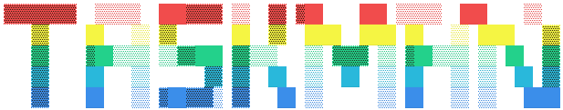

A keyboard-driven task management system with AI task followup capabilities.
Intended to track tasks across multiple 'real' people and continually follow up
with them to get status updates using AI. built for the terminal.

## Features

- **Terminal UI** - Fast, keyboard-first interface built with Ink
- **AI Integration** - Store chat history and run asynchronous AI tasks
- **Type-Safe API** - End-to-end type safety with TRPC
- **Modern Stack** - Built on Deno 2.4.2 with TypeScript

## Architecture

TaskMan uses a client-server architecture:

- **Backend**: REST/TRPC API server (Deno)
- **Database**: PostgreSQL for persistent storage
- **CLI**: React-based TUI client (Deno + Ink)

## Getting Started

Open DevContainer and run.

```bash
# Start the backend and database
docker-compose up --build

# Start the CLI client
deno task cli

# Have a blast!
```

## Development

The project is in early development. Current status:

- ✅ Backend scaffolding with TRPC
- ✅ Docker setup for development
- 🚧 Core API implementation
- 📋 CLI client (not started)

See [ARCHITECTURE.md](ARCHITECTURE.md) for detailed system design.
